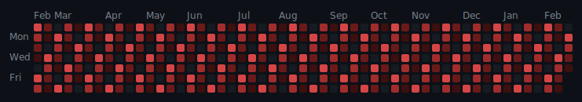

# `git big`

GitHub-style fitness contribution graph for your GitHub profile, powered by Strava.



## Quick Start (Lowest Friction)

Use this if someone is already hosting `git big` on Vercel.

1. Open this URL in your browser:

```text
https://<your-git-big-domain>/api/strava/connect?github=<YourGitHubUsername>
```

2. Authorize Strava.
3. Copy the generated markdown snippet shown on the callback page.
4. Paste it into your GitHub profile README (`<username>/<username>` repo).

That is all. Daily refresh runs automatically.

## Self-Host in Your Repo (5 Minutes)

Use this if you want full control of your Strava app/secrets.

1. Fork this repo (or use it as a template).
2. Create a Strava API app at [strava.com/settings/api](https://www.strava.com/settings/api).
3. Set Strava callback domain to `localhost` for local setup.
4. Install [GitHub CLI](https://cli.github.com/) and authenticate:

```bash
gh auth login
```

5. Run the guided setup wizard:

```bash
npm install
npm run setup
```

The wizard handles OAuth, stores secrets in your repo, and can trigger the first graph run.

6. Add this to your profile README:

```markdown


```

## Hosted Mode (For Operators)

If you want to host one shared instance for many users:

1. Deploy to Vercel.
2. Add Upstash Redis.
3. Configure `GITBIG_*` environment variables.
4. Set Strava callback domain to your deployed domain.

Full guide: [docs/HOSTED_VERCEL.md](./docs/HOSTED_VERCEL.md)

## Output Files

`npm run generate` writes:

- `dist/git-big.svg`
- `dist/git-big-dark.svg`
- `dist/git-big-light.svg`
- `dist/git-big-levels.json`

Legacy `fithub*` files are still written for backward compatibility.

## Import Historical Data

`git big` reads Strava activity data. If older workouts are missing from Strava, they will not appear in the graph.

### Garmin / Wahoo / Other Device Apps

Connect directly in Strava at [strava.com/settings/apps](https://www.strava.com/settings/apps). Some integrations backfill older data automatically.

### Apple Health

Apple Health integration usually syncs new activities only. For older workouts:

1. Export Apple Health XML from iPhone (`Health` -> profile -> `Export All Health Data`).
2. Unzip the export on your computer.
3. Convert with:

```bash
npx tsx scripts/apple-health-to-tcx.ts ~/Downloads/apple_health_export/export.xml
```

4. Upload generated TCX files at [strava.com/upload/select](https://www.strava.com/upload/select) (up to 25 at a time).
5. Upload GPX files from `workout-routes/` for route-based workouts.

### Other Platforms

If you can export `.fit`, `.tcx`, or `.gpx`, upload directly to Strava at [strava.com/upload/select](https://www.strava.com/upload/select).

## Troubleshooting

### "I should have more active days"

`git big` renders only the last 365 days, like GitHub contributions. If Strava does not return older activities in that window yet, the graph will look sparse until Strava finishes processing/importing.

### "OAuth succeeded but graph is empty"

Verify:

- GitHub username in connect URL is correct.
- README image URL uses your correct username/repo/branch.
- Strava authorization used `activity:read_all`.

### "Refresh token changed"

Strava rotates refresh tokens. Update `STRAVA_REFRESH_TOKEN` secret after re-authorization.

## Development

```bash
npm install
npm run lint
npm run typecheck
npm test
npm run build
```

## Links

- [GitHub repo](https://github.com/WestonBDev/git-big)
- [Strava API docs](https://developers.strava.com/)
- [Contributing guide](./CONTRIBUTING.md)
- [Security policy](./.github/SECURITY.md)
- [MIT License](./LICENSE)
