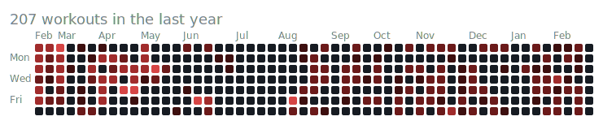
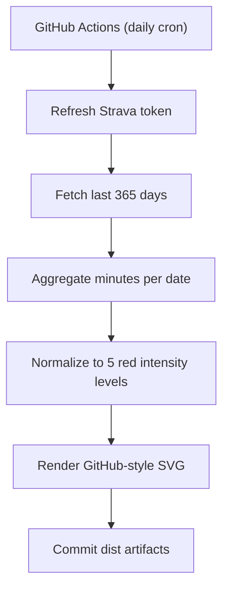

# FitHub Graph

GitHub-native fitness contribution graph powered by Strava activity minutes.

- Green graph: code
- Red graph: discipline

## Preview


## 2-Minute Setup

1. Fork this repo (or use it as a template).
2. Create a Strava API app at [https://www.strava.com/settings/api](https://www.strava.com/settings/api).
Set the Strava app callback domain to `localhost`.
3. Install GitHub CLI and authenticate:

```bash
gh auth login
```

4. Run the guided setup:

```bash
npm install
npm run setup
```

The wizard will:
- guide OAuth and capture your Strava refresh token
- set GitHub repo secrets (`STRAVA_CLIENT_ID`, `STRAVA_CLIENT_SECRET`, `STRAVA_REFRESH_TOKEN`)
- optionally set `REPO_ADMIN_TOKEN` for automatic token rotation
- optionally set `FITHUB_THRESHOLDS`
- optionally trigger the update workflow

5. Embed in your profile README:

```markdown

```

## Architecture



## Repository Layout

```text
src/
  fetch.ts
  normalize.ts
  render.ts
tests/
  fetch.test.ts
  normalize.test.ts
  render.test.ts
dist/
.github/workflows/
README.md
CONTRIBUTING.md
LICENSE
```

## Local Development

```bash
npm install
npm run lint
npm run typecheck
npm test
```

Guided setup wizard:

```bash
npm run setup
```

Generate artifacts locally (requires Strava env vars):

```bash
npm run generate
```

Output files:
- `dist/fithub.svg`
- `dist/fithub-levels.json`

## Profile Widget

Use this image in your profile README (`WestonBDev/WestonBDev`):

```markdown

```

## Roadmap

- V0.2: configurable metrics (distance/calories/steps) and light theme
- V0.3: multi-provider abstraction and adapters
- V0.4: hosted SaaS + dual overlay mode (code vs fitness)

## License

MIT
